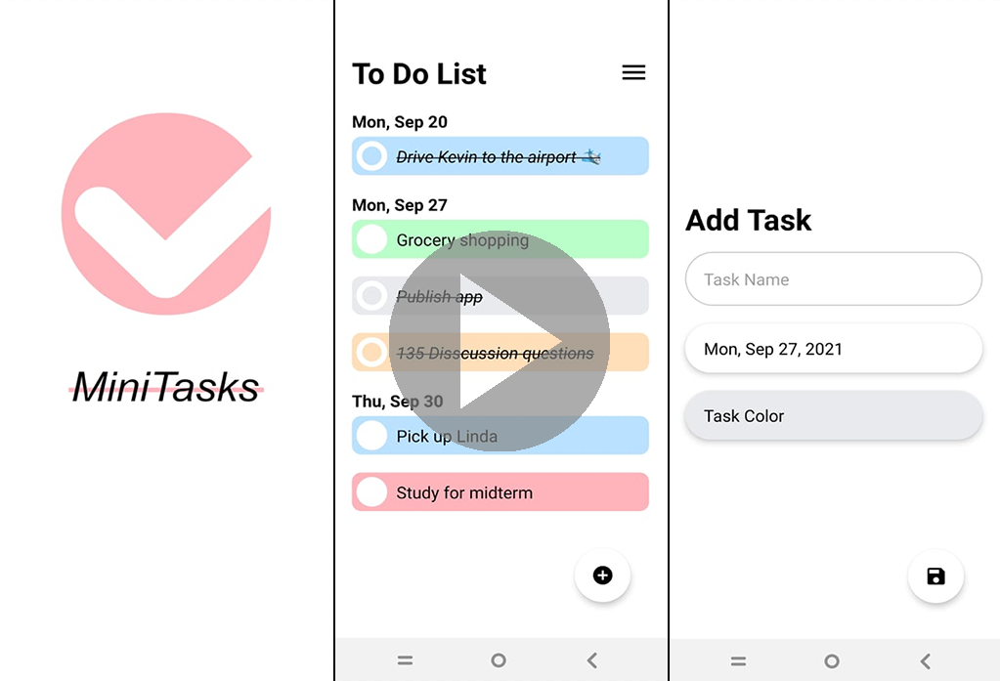

# Minitasks
### Youtube Demo: https://youtu.be/yPC58yBRJiU
[](https://www.youtube.com/watch?v=yPC58yBRJiU)
- App Store: https://play.google.com/store/apps/details?id=com.jeffwang4321.MiniTasks

- Developed a minimalistic and easy to use To Do List using React Native and Expo

- Implemented persistent storage to store tasks JSON locally within the device

- Focused on state manipulation, asynchronous functions, promises and hooks

## Features:
- Create, modify & delete custom tasks

- Set and sort tasks by due dates and task color

- Delete all tasks and/or delete selected tasks

## How to Test

```
$ npm install
$ expo start
```
